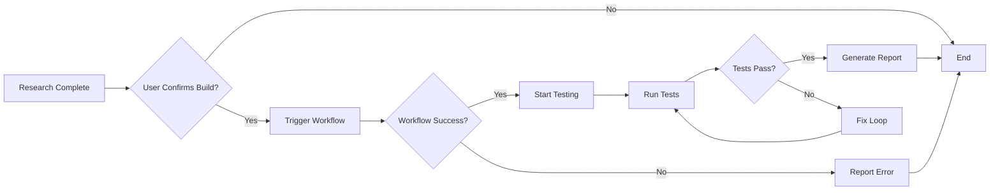

# Workflow Integration Guide

This document explains how to trigger and monitor the CreateReferenceConnectionWorkflow from the CreateReferenceConnection script.

## Workflow Overview

**Name:** `CreateReferenceConnectionWorkflow`

**Purpose:** Generates a complete Ivy connection implementation from a research markdown file.

**Location:** Ivy Workflows (published to Ivy runtime)

**Input:** Research markdown file at `D:\Repos\_Ivy\Ivy\connections\.research\<ServiceName>.md`

**Output:** Complete connection project at `D:\Repos\_Ivy\Ivy\connections\<ServiceName>\`

## Triggering the Workflow

### Method 1: Via Ivy Agent Tool
```markdown
Use the Ivy Agent to trigger the workflow:

Agent tool with:
- subagent_type: "Workflow"
- task: "Execute CreateReferenceConnectionWorkflow for <ServiceName>"
```

### Method 2: Via Ivy CLI (if available)
```powershell
# Assuming Ivy CLI exists and is configured
ivy workflow run CreateReferenceConnectionWorkflow --service <ServiceName>
```

### Method 3: Direct API Call (if available)
```powershell
# If Ivy exposes a workflow API endpoint
Invoke-RestMethod -Uri "http://localhost:5000/api/workflows/execute" `
  -Method Post `
  -Body (@{
    workflowName = "CreateReferenceConnectionWorkflow"
    parameters = @{
      serviceName = "<ServiceName>"
    }
  } | ConvertTo-Json) `
  -ContentType "application/json"
```

## Workflow Parameters

| Parameter | Type | Required | Description |
|-----------|------|----------|-------------|
| `serviceName` | string | Yes | Name of the service (e.g., "Claude", "Stripe") |
| `researchFile` | string | No | Path to research file (defaults to `.research\<ServiceName>.md`) |
| `outputPath` | string | No | Output directory (defaults to `connections\<ServiceName>`) |

## Monitoring Workflow Execution

### Status Indicators
- **Queued** - Workflow accepted, waiting to start
- **Running** - Workflow actively executing
- **Completed** - Workflow finished successfully
- **Failed** - Workflow encountered an error

### Progress Tracking
Monitor workflow output for these milestones:
1. ✓ Research file loaded
2. ✓ Connection class generated
3. ✓ Test class generated
4. ✓ Demo apps created
5. ✓ Program.cs configured
6. ✓ GlobalUsings.cs created
7. ✓ Build successful

### Expected Duration
- **Fast:** 30-60 seconds (simple connection)
- **Normal:** 1-3 minutes (standard connection with 2-3 apps)
- **Slow:** 3-5 minutes (complex connection with many entities)

If workflow exceeds 10 minutes, investigate for:
- Network issues (downloading packages)
- Build errors (compilation failures)
- API rate limits (external calls)
- Workflow bugs (infinite loops, deadlocks)

## Workflow Output Structure

After successful completion, expect this structure:

```
D:\Repos\_Ivy\Ivy\connections\<ServiceName>\
├── Ivy.Connections.<ServiceName>\
│   ├── Apps\
│   │   ├── ChatApp.cs              # Example: chat demo
│   │   └── ModelsApp.cs            # Example: models demo
│   ├── Connections\
│   │   └── <ServiceName>Connection.cs
│   ├── Tests\
│   │   └── <ServiceName>ConnectionTests.cs
│   ├── Ivy.Connections.<ServiceName>.csproj
│   ├── Program.cs                  # Ivy launcher
│   └── GlobalUsings.cs             # Standard usings
├── connection.yaml                 # Connection metadata
└── logo.svg                        # Service logo
```

## Validation After Workflow

Before proceeding to testing phase, verify:

### 1. Project Structure
```powershell
# Check all required files exist
Test-Path "D:\Repos\_Ivy\Ivy\connections\<ServiceName>\Ivy.Connections.<ServiceName>\Program.cs"
Test-Path "D:\Repos\_Ivy\Ivy\connections\<ServiceName>\Ivy.Connections.<ServiceName>\Connections\<ServiceName>Connection.cs"
Test-Path "D:\Repos\_Ivy\Ivy\connections\<ServiceName>\Ivy.Connections.<ServiceName>\Tests\<ServiceName>ConnectionTests.cs"
```

### 2. Connection Class
```powershell
# Verify connection implements IConnection
$connectionFile = Get-Content "D:\Repos\_Ivy\Ivy\connections\<ServiceName>\Ivy.Connections.<ServiceName>\Connections\<ServiceName>Connection.cs" -Raw
$connectionFile -match "class.*Connection\s*:\s*IConnection"
```

### 3. Build Configuration
```powershell
# Check .csproj for correct framework
$csproj = Get-Content "D:\Repos\_Ivy\Ivy\connections\<ServiceName>\Ivy.Connections.<ServiceName>\Ivy.Connections.<ServiceName>.csproj" -Raw
$csproj -match "<TargetFramework>net[89]\."
```

### 4. Required Methods
Verify connection class has all required methods:
- `GetName()`
- `GetConnectionType()`
- `GetSecrets()`
- `GetEntities()`
- `RegisterServices()`
- `TestConnection()`

## Error Handling

### Workflow Not Found
**Error:** `WorkflowNotFoundException: CreateReferenceConnectionWorkflow does not exist`

**Solutions:**
1. Check workflow is published in Ivy
2. Verify workflow name spelling
3. Restart Ivy runtime if recently deployed

### Workflow Execution Failed
**Error:** `WorkflowExecutionException: Failed to generate connection`

**Common Causes:**
- Invalid research file format
- Missing required sections (NuGet package, secrets)
- Network issues downloading packages
- File system permissions

**Debugging:**
1. Check workflow logs in Ivy
2. Verify research file is valid markdown
3. Ensure all required sections present
4. Check file system permissions

### Workflow Timeout
**Error:** `TimeoutException: Workflow exceeded maximum execution time`

**Solutions:**
1. Check network connectivity
2. Verify no infinite loops in workflow
3. Increase workflow timeout if legitimate
4. Break down into smaller workflows

## Integration with Testing

### Workflow → Test Flow



### Automated Build + Test

```powershell
# Complete end-to-end automation
param([string]$ServiceName)

# 1. Research phase (manual or automated)
# ... research happens ...

# 2. Trigger workflow
Write-Host "Building connection..." -ForegroundColor Yellow
# Trigger CreateReferenceConnectionWorkflow for $ServiceName
# Wait for completion...

# 3. Run tests
Write-Host "Running tests..." -ForegroundColor Yellow
& "D:\Repos\_Personal\Scripts\AF2\CreateReferenceConnection\Tools\RunConnectionTests.ps1" -ServiceName $ServiceName

# 4. Review report
Write-Host "Test report: D:\Temp\CreateReferenceConnectionTest\$ServiceName\.ivy\tests\report.md" -ForegroundColor Green
```

## Workflow Communication

### Progress Updates
During workflow execution, capture these events:
- Step started
- Step completed
- File generated
- Error encountered
- Warning raised

### Output Capture
```powershell
# Capture workflow output for debugging
$workflowOutput = @()

# Start workflow with output capture
$workflow = Start-IvyWorkflow -Name "CreateReferenceConnectionWorkflow" -Parameters @{
    serviceName = $ServiceName
} -CaptureOutput

# Monitor progress
while ($workflow.Status -eq "Running") {
    $output = Get-IvyWorkflowOutput -Id $workflow.Id -Since $lastCheck
    $workflowOutput += $output
    Start-Sleep -Seconds 1
}

# Save output to log
$workflowOutput | Out-File "$TestDir\workflow.log"
```

## Troubleshooting Tips

### Workflow Hangs
1. Check CPU usage (infinite loop?)
2. Check network activity (waiting for download?)
3. Review last logged step
4. Force kill and retry with verbose logging

### Partial Generation
If workflow completes but files missing:
1. Check workflow logs for skipped steps
2. Verify research file has all sections
3. Check file system for permission errors
4. Manually create missing files as workaround

### Build Errors After Generation
If workflow succeeds but connection won't build:
1. Generated code may have syntax errors
2. NuGet package may be incompatible
3. Framework version mismatch
4. Report back to workflow developers

## Future Enhancements

### Planned Improvements
- [ ] Real-time progress streaming
- [ ] Rollback on failure
- [ ] Incremental generation (update existing)
- [ ] Validation before execution
- [ ] Dry-run mode

### Integration Ideas
- [ ] GitHub Actions integration
- [ ] Slack notifications
- [ ] Email reports
- [ ] Dashboard for multiple connections

## Update Instructions

As workflow behavior changes:
1. Update workflow name if renamed
2. Document new parameters
3. Update expected output structure
4. Revise validation steps
5. Add new error scenarios
